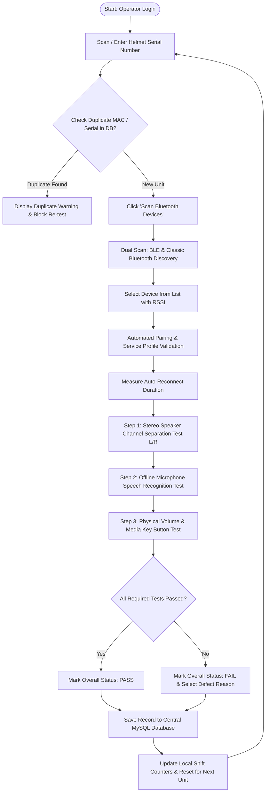

# Functional Specification Document (FS)
## Project: Studds QC Bluetooth Device Inspection Application
**Document Reference:** STUDDS-QC-FS-V1.0  
**Target Platform:** Windows 10 / 11 (64-bit) Workstation  
**Author:** Studds QA & Software Engineering Team  
**Status:** Approved / Ready for Review  

---

## 1. Document Control & Revision History

| Version | Date | Author / Role | Description of Changes |
| :--- | :--- | :--- | :--- |
| **v1.0** | 2026-08-26 | QA & Software Engineering | Initial Comprehensive Functional Specification baseline covering complete QC workflow, Bluetooth dual-scanning, speaker/mic/button testing, duplicate checking, database persistence, and CSV reporting. |

---

## 2. Executive Summary & Business Objective

### 2.1 Background
**Studds Accessories Ltd.** manufactures premium smart helmets, Bluetooth-integrated intercom units, and audio accessories. Ensuring 100% defect-free Bluetooth connectivity, speaker sound quality, microphone voice capture clarity, and physical button responsiveness prior to packaging is essential for product quality and customer satisfaction.

### 2.2 Project Objective
The **Studds QC Bluetooth Device Inspection Application** is a self-contained, offline-capable desktop inspection station designed to:
1. **Automate & Standardize QC Inspection:** Eliminate manual testing variability by enforcing a guided, step-by-step diagnostic workflow.
2. **Accelerate Line Throughput:** Complete comprehensive device qualification (Bluetooth pairing, audio, mic, buttons) in under 45 seconds per unit.
3. **Ensure Zero Cloud Dependency:** Function seamlessly on factory floor workstations with local speech recognition and direct device communication.
4. **Enforce Traceability:** Prevent duplicate serial/MAC submissions and log every inspection with timestamp, operator ID, individual test results, and PASS/FAIL evaluation to a centralized MySQL database.

---

## 3. User Roles & Personas

| Role | Persona | Responsibilities & Access in System |
| :--- | :--- | :--- |
| **Line Operator** | Factory Floor Inspector | - Logs in with Operator ID. - Scans helmet serial barcodes. - Triggers automated Bluetooth discovery & pairing. - Evaluates speaker stereo channel audio cues. - Speaks test phrases into the microphone. - Actuates physical buttons. - Submits final inspection results. |
| **QC Supervisor** | Line Quality Lead | - Monitors live production yields and pass/fail rates. - Reviews failure logs and defect reasons. - Filters inspection history. - Exports shift/daily quality records to CSV. - Overrides duplicate test blocks when authorized for rework. |
| **System Admin / Automation Engineer** | Plant IT / Tech Support | - Installs and updates workstation binaries. - Configures `db_config.json` database connection endpoints. - Calibrates audio/microphone hardware endpoints. |

---

## 4. End-to-End Functional Workflow

---

## 5. Detailed Functional Requirements by Module

### 5.1 Module 1: Operator Authentication & Helmet Identification
- **REQ-FS-01.1 (Operator Login):**
  - The system shall mandate entry of an **Operator ID** (alphanumeric, 2–50 characters) upon application launch.
  - The active Operator ID shall remain stored in the session and automatically attached to all subsequent inspection records until explicitly changed.
- **REQ-FS-01.2 (Barcode Scanner Input):**
  - The system shall provide an auto-focused Helmet Serial Number input field compatible with standard USB/Bluetooth 1D/2D barcode scanners (HID keyboard wedge mode).
  - Pressing `Enter` or receiving a scanner suffix character shall automatically initiate duplicate verification.
- **REQ-FS-01.3 (Duplicate Inspection Validation):**
  - The system shall automatically query the central database for existing records matching the scanned Serial Number or discovered MAC address.
  - If an existing record exists, a visual amber warning badge (`DUPLICATE INSPECTION DETECTED`) shall be displayed along with the previous inspection timestamp and operator ID.

---

### 5.2 Module 2: Bluetooth Device Discovery, Pairing & Diagnostics
- **REQ-FS-02.1 (Dual-Radio Scanning):**
  - The system shall simultaneously scan for Classic Bluetooth devices (using Windows WinSDK) and Bluetooth Low Energy (BLE) peripherals (using Bleak).
  - Scanning duration shall run for a user-configurable window (default: 5 seconds) and display an active radar scanning visualizer.
- **REQ-FS-02.2 (Device Discovery List):**
  - Discovered units shall be rendered in a dynamic list displaying:
    - Friendly Device Name (e.g., *STUDDS BT-01*, *S-INTERCOM*).
    - Bluetooth MAC Address (e.g., `AA:BB:CC:11:22:33`).
    - Real-time Received Signal Strength Indicator (RSSI badge in dBm).
    - Device Type Indicator (Classic Audio / BLE).
- **REQ-FS-02.3 (Automated Hardware Pairing & Bonding):**
  - Selecting a device and initiating the test shall trigger automated pairing via the Windows Bluetooth API without prompting the operator for manual PIN confirmation dialogs.
- **REQ-FS-02.4 (Bluetooth Profile Validation):**
  - The system shall verify and display status for the following standard Bluetooth profiles:
    - **A2DP** (Advanced Audio Distribution Profile - Audio Sink: `0000110b-...`)
    - **HFP** (Hands-Free Profile: `0000111e-...`)
    - **HSP** (Headset Profile: `00001108-...`)
    - **AVRCP** (Audio/Video Remote Control Profile)
- **REQ-FS-02.5 (Auto-Reconnect Latency Benchmark):**
  - The system shall execute a temporary disconnect/reconnect cycle to benchmark link recovery speed.
  - Reconnect latency shall be logged in seconds (e.g., `1.85s`). Reconnections exceeding 5.0 seconds shall trigger a latency warning.

---

### 5.3 Module 3: Stereo Speaker Channel Separation Test
- **REQ-FS-03.1 (Audio Playback Engine):**
  - The system shall play an embedded stereo audio test asset (`Stereo sound tiny test with clean channels.mp3`) via the native Windows MCI subsystem with zero noticeable latency.
- **REQ-FS-03.2 (Channel Isolation Sequence):**
  - The test asset shall play clear audio tone/speech strictly through the **Left Channel (L)**, pause for 500ms, and then play strictly through the **Right Channel (R)**.
  - The UI shall display animated Left/Right speaker wave visualizers synchronized with playback.
- **REQ-FS-03.3 (Operator Evaluation Grading):**
  - The operator shall grade the speaker test using three explicit buttons:
    - **Passed (Green):** Clear audio heard in both left and right speakers independently.
    - **Failed (Red):** Audio missing in one channel, distorted, noisy, or unbalanced.
    - **Skipped (Grey):** Test bypassed (requires supervisor override).

---

### 5.4 Module 4: Offline Microphone & Speech Recognition Test
- **REQ-FS-04.1 (100% Offline Speech-to-Text):**
  - The system shall transcribe speech locally using the bundled Vosk lightweight neural model without sending any data over the internet or local area network.
- **REQ-FS-04.2 (Zero-Latency Mic Detection):**
  - The UI shall initialize the microphone visualizer immediately (0ms tick) upon Bluetooth connection, utilizing cached device permissions to eliminate operator waiting time.
- **REQ-FS-04.3 (Voice Capture & Transcription Display):**
  - The operator speaks standard test phrases (e.g., *"Testing one two three"*, *"Studds quality check"*).
  - The UI shall render real-time audio volume VU bars and display the live transcribed text along with model confidence percentage.
- **REQ-FS-04.4 (Bluetooth Audio Gateway Nudge):**
  - If the headset microphone endpoint is dormant, the system shall provide an automated `/nudge_mic` routine to re-engage the Windows Hands-Free Audio Gateway service.
- **REQ-FS-04.5 (Microphone Evaluation Grading):**
  - The operator or automated confidence threshold (configurable, default: $\ge 70\%$) shall mark the test as `PASSED`, `FAILED`, or `SKIPPED`.

---

### 5.5 Module 5: Physical Hardware Button & Volume Sensor Test
- **REQ-FS-05.1 (Volume Button Sensing):**
  - The system shall monitor Windows CoreAudio endpoint master volume levels.
  - When the operator presses the physical **Volume Up (+)** button on the helmet, the UI shall instantly highlight the Volume Up badge in bright green with an audio chime.
  - When the operator presses the physical **Volume Down (-)** button, the UI shall highlight the Volume Down badge in bright green.
- **REQ-FS-05.2 (Media & Multi-Function Key Sensing):**
  - The system shall intercept low-level hardware media keys (`VK_MEDIA_PLAY_PAUSE`, `VK_VOLUME_UP`, `VK_VOLUME_DOWN`) via keyboard hooks and light up corresponding UI status indicators.
- **REQ-FS-05.3 (Button Evaluation Grading):**
  - The test automatically transitions to `PASSED` when both Volume (+) and Volume (-) actuations are registered within the inspection session.

---

### 5.6 Module 6: Inspection Summary, Defect Classification & Submission
- **REQ-FS-06.1 (Automated Overall Evaluation):**
  - The system shall compute the overall verdict:
    - **PASS:** All mandatory sub-tests (Bluetooth Pairing, Speaker L/R, Microphone STT, Physical Buttons) marked as `PASSED`.
    - **FAIL:** Any mandatory sub-test marked as `FAILED` or uncompleted.
- **REQ-FS-06.2 (Defect Classification Matrix):**
  - If a unit fails, the system shall provide a standardized dropdown for failure root-cause tagging:
    - *Bluetooth Pairing Timeout / Hardware Not Found*
    - *Left Speaker Open Circuit / No Sound*
    - *Right Speaker Open Circuit / No Sound*
    - *Speaker Distortion / Channel Bleed*
    - *Microphone Inaudible / Defective Capsule*
    - *Volume Up Button Non-Responsive*
    - *Volume Down Button Non-Responsive*
    - *Excessive Reconnect Latency (>5s)*
    - *Other Hardware / Enclosure Defect*
- **REQ-FS-06.3 (Database Persistence):**
  - Submitting the inspection record shall write a complete structured row to the central MySQL `inspection_logs` table.
- **REQ-FS-06.4 (Offline Fallback Buffering):**
  - If the central MySQL database is temporarily unreachable, the application shall display a warning banner in the top navigation bar, buffer records locally in an encrypted emergency log file, and attempt reconnection automatically.

---

### 5.7 Module 7: Historical Logs, Filtering & Native CSV Export
- **REQ-FS-07.1 (Inspection Log Viewer):**
  - The application shall provide an integrated **Reports & History** tab displaying the last 100+ inspections with columns: *ID, Timestamp, Operator ID, Serial Number, MAC, Speaker, Mic, Button, Overall Status, Failure Reason*.
- **REQ-FS-07.2 (Live Shift Metrics):**
  - The top dashboard navbar shall display live counters:
    - **Total Tested Today**
    - **Passed Count & Pass Yield %**
    - **Failed Count & Defect %**
- **REQ-FS-07.3 (Native Windows Save File Dialog):**
  - Clicking **Export to CSV** shall open the native Windows Save Dialog (`DesktopApi.save_csv`), allowing supervisors to export filtered logs with formatted headers directly to desktop or network shares.

---

## 6. User Interface & Screen Layout Specification

### 6.1 Screen Layout Breakdown
The interface uses a single-page responsive dashboard powered by Bootstrap 5 with high-contrast factory-floor styling:

1. **Header Bar:**
   - Studds Brand Logo & Application Title.
   - Active Operator ID Badge (with "Change Operator" action).
   - MySQL Database Connectivity Status Indicator (🟢 Online / 🔴 Offline).
   - Real-time Shift Yield Counters (Total, Passed %, Failed %).
2. **Left Panel (Device Discovery & Pairing Console):**
   - Helmet Serial Number Input with Barcode Auto-Trigger.
   - "Scan Bluetooth Devices" Action Button with Animated Radar.
   - Discovered Bluetooth Device Table with Signal (RSSI) Badges and "Test Unit" button.
   - Diagnostic Progress Bar & Reconnection Latency Benchmark Card.
3. **Right Panel (Interactive Test Workstation):**
   - **Speaker Test Card:** Left/Right speaker visualizer, Play/Stop audio trigger, Pass/Fail/Skip toggles.
   - **Microphone Test Card:** Audio level VU bar, live transcription bubble, confidence meter, Pass/Fail toggles.
   - **Button Test Card:** Real-time Vol (+), Vol (-), and Play/Pause interactive LED indicators.
   - **Final Verdict Card:** Large PASS / FAIL Banner, Defect Reason Dropdown, "Submit & Next Unit" Button.
4. **Bottom Panel (Historical Inspection Logs & Export):**
   - Tabular yield history with search filter by Serial / MAC / Date and "Export CSV" trigger.

---

## 7. Business Rules & Validation Logic

| Rule ID | Rule Name | Description & Enforcement |
| :--- | :--- | :--- |
| **BR-01** | Mandatory Operator Identification | An inspection session cannot be started unless a non-empty `operator_id` is registered. |
| **BR-02** | Mandatory Serial Number | The system will disable test execution buttons if the `helmet_serial_number` field is empty. |
| **BR-03** | Duplicate Prevention | If a MAC address was already logged as `PASSED` within the last 24 hours, the system requires explicit supervisor confirmation before allowing re-inspection. |
| **BR-04** | All-Pass Requirement | `overall_status` can only be set to `PASS` if `speaker_test_status == 'PASSED'`, `mic_test_status == 'PASSED'`, and `button_test_status == 'PASSED'`. |
| **BR-05** | Mandatory Defect Tagging | If `overall_status == 'FAIL'`, the `failure_reason` field becomes mandatory prior to database submission. |
| **BR-06** | Post-Test Cleanliness | Upon saving a report or moving to the next unit, the system automatically unpairs the Bluetooth device to ensure the workstation adapter is free for the next unit. |

---

## 8. Non-Functional Requirements (Functional Perspective)

1. **Ergonomics & Touch/Mouse Usability:** All interactive buttons must have a minimum hit target of $48\text{px} \times 48\text{px}$ to facilitate fast operation on touchscreen or ruggedized mouse terminals.
2. **Auditory & Visual Feedback:** Every pass action must trigger a positive high-contrast green visual cue; failure actions must trigger a distinct red alert badge.
3. **Inspection Cycle Time:** The complete end-to-end inspection sequence for a functional unit must be achievable in $\le 45\text{ seconds}$.
4. **Self-Healing Connectivity:** The application must automatically recover if the Bluetooth helmet disconnects unexpectedly, guiding the operator with clear on-screen instructions.
